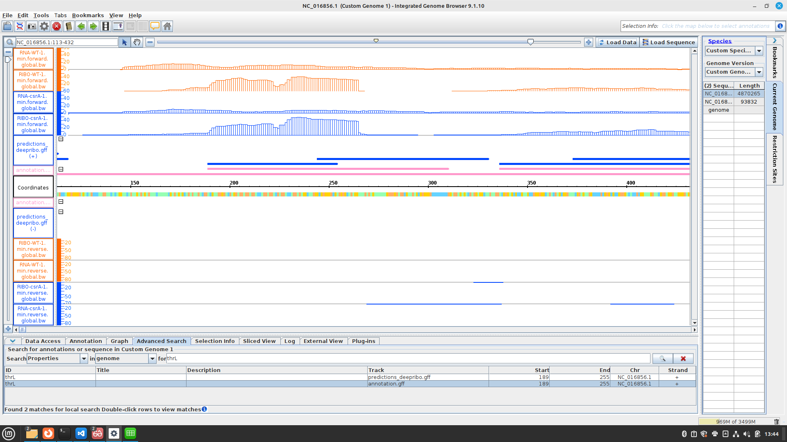

conda install -c bioconda bioconductor-deseq2 -y
conda install -c bioconda segemehl -y
conda install -c r r-gplots -y

questions to answer with IGB:

1. start codon of the csrA gene: first bases (from right to left, bc its the reverse strand) is TAC, so the start codon is ATG 
2. its stop codon: same logic as above. TAA
3. its length in amino acids: gene is 186 nucleotides. divided by 3 is 62, but as the stop codon doesn't code for an AA the protein is 61 AA long
4. its SD (consensus AGGAGG at -7 to -4): AGGAG at -7
5. the name of the upstream gene: alaS
6. is csrA translated: yes. the coverage of the ribo-seq fits the gene. criteria: peaks (coverage) at the gene locus, no coverage at UTR.(RNA seq shows also UTR, as it only shows transcription)

